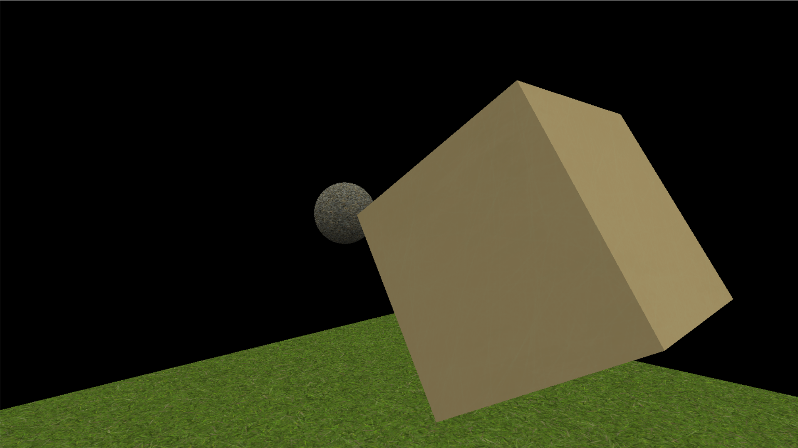

# Rasterization-Renderer

A basic software rasterization-based 3D renderer built with C++ and SDL.

## Overview
- [Rasterization-Renderer](#rasterization-renderer)
  - [Overview](#overview)
  - [Features](#features)
  - [Requirements](#requirements)
  - [Installation](#installation)
    - [Windows (MSYS2)](#windows-msys2)
  - [Usage](#usage)
    - [Controls](#controls)
    - [Creating a New Scene](#creating-a-new-scene)
  - [Using as a library](#using-as-a-library)
  - [Project Structure](#project-structure)
    - [Core Components](#core-components)
  - [Performance](#performance)
  - [License](#license)




## Features

- **Build to be used as a library**: Easialy use this renderer as a library
- **Rasterization Rendering:** Fast CPU-based 3D rendering using rasterization
- **Multi-threaded Rendering:** Optimized performance using thread pools
- **Scene Management:** Support for loading 3D objects (in .obj format)
- **Camera Controls:** First-person camera with mouse and keyboard input
- **Texture Support:** Both basic and lit texture shading
- **Performance:** Real-time rendering with FPS counter

## Requirements

- C++17 or later
- SDL2 and SDL2_image
- A C++ compiler (GCC, Clang, or MSVC)

## Installation

### Windows (MSYS2)

1. Install MSYS2 from https://www.msys2.org/

2. Open MSYS2 UCRT64 terminal and install dependencies:
```bash
pacman -S mingw-w64-ucrt-x86_64-gcc
pacman -S mingw-w64-ucrt-x86_64-SDL2
pacman -S mingw-w64-ucrt-x86_64-SDL2_image
```

3. Clone and build the project:
```bash
git clone https://github.com/I-had-a-bad-idea/Rasterization-Renderer.git
cd Rasterization-Renderer
g++ -O3 -I. -I./Helper -I./Math -I./Object -I./Rendering -I./Scenes ./*.cpp ./Helper/*.cpp ./Math/*.cpp ./Object/*.cpp ./Rendering/*.cpp ./Scenes/*.cpp -lSDL2 -lSDL2_image -lopengl32 -o renderer.exe
```

## Usage

Run the compiled executable:
```bash
Rasterization_renderer.exe
```

### Controls
- **W, A, S, D:** Move the camera forward, left, backward, and right
- **Mouse:** Look around 
- **ESC:** Exit the application

### Creating a New Scene

To add your own scene to the renderer, follow these steps:

1. **Create a Scene Class**
   
   - In the `Scenes/` directory, create a new header and source file for your scene (e.g., `MyScene.h` and `MyScene.cpp`).
   - Inherit from the `Scene` base class and implement the `Setup()` and `Update(RenderTarget& target, float delta_time)` methods.

   Example (`Scenes/MyScene.h`):
   ```cpp
   #ifndef MY_SCENE_H
   #define MY_SCENE_H

   #include "Scene.h"

   class MyScene : public Scene {
   public:
       void Setup() override;
       void Update(RenderTarget& target, float delta_time) override;
   };

   #endif
   ```

   Example (`Scenes/MyScene.cpp`):
   ```cpp
   #include "MyScene.h"
   #include "Object/Obj_loader.h"
   #include "Object/Object.h"

   void MyScene::Setup() {
       // Add objects to the scene
       Object myObject(ObjLoader::load_object("/Objects/Cube.obj", "/Textures/Metal_golden.png", float3(0,0,0), float3(0,0,0), "cube"));
       objects.push_back(myObject);
       camera.Fov = 60;
   }

   void MyScene::Update(RenderTarget& target, float delta_time) {
       // Handle input or animate objects here
   }
   ```

2. **Register and Use Your Scene**
   
   - In `main.cpp`, include your new scene header and instantiate your scene instead of the default one.
   - Replace the usage of `TestScene` with your new scene class.

   Example:
   ```cpp
   #include "Scenes/MyScene.h"
   // ...
   int main(int argc, char* argv[]) {
       RenderTarget target(1280, 720);
       MyScene scene;
       scene.Setup();
       Run(target, scene);
       return 0;
   }
   ```

3. **Compile and Run**
   
   - Rebuild the project and run the executable to see your custom scene.

**Tip:**  
Look at `Scenes/Test_scene.cpp` and `Scenes/Test_scene.h` for a complete example of a scene implementation.

## Using as a library

Simply add it as a submodule:
```bash
git submodule add https://github.com/I-had-a-bad-idea/Rasterization-Renderer.git external/Raterization-Renderer
```
then create a [custom scene](#creating-a-new-scene)
then import `main.h` and your scene. Then use the whole thing:
```cpp
#include <Rasterization-Renderer/main.h>
#include "World-Scene/world.h"

int main(void)
{
    // Define render target size
    int width = 960;
    int height = 540;
    // Create scene
    World world;
    world.Setup(); 
    // Create render target
    RenderTarget render_target(width, height);
    // Start renderer loop
    Run(render_target, scene);
    return 0;
}
```
Run this in a background thread to not block your main programm code.
you can still modify your Scene, as Run only takes a reference.

## Project Structure

```
Rasterization-Renderer/
├── Helper/           # Utility functions and helpers
├── Math/            # Math operations and vector types
├── Object/          # 3D object and mesh handling
├── Rendering/       # Core rendering functionality
├── Scenes/          # Scene management and test scenes
└── main.cpp         # Application entry point
```

### Core Components

- [**Rasterizer:**](Rendering/Rasterizer.cpp) Main rendering pipeline implementation
- [**Math:**](Math/Maths.cpp) Implementation of all the math 
- [**Threadpool:**](Rendering/Threadpool.cpp) Threadpool for multithreading
- [**RenderTarget:**](Rendering/RenderTarget.h) Frame buffer and depth buffer management
- [**Object:**](Object/Object.h) 3D object with model, shader and [transform](Object/ObjectTransform.h)
- [**Mesh:**](Object/Object_mesh.cpp) Representation of a 3D model with texture
- [**Obj_Loader:**](Helper/Obj_loader.cpp) Loads an .obj file and creates a mesh
- [**Scene:**](Scenes/Scene.h) Camera and object management ([Example Scene](Scenes/Test_scene.cpp))

## Performance
- Thread pool for triangle rasterization
- Optimized vertex transformation
- Efficient back-face culling
- Fast depth testing

## License

This project is licensed under the MIT License - see the [LICENSE](LICENSE) file for details.


Created using <Metal 048 A>, <Gravel 041> <Grass 005> from ambientCG.com,
licensed under the Creative Commons CC0 1.0 Universal License.